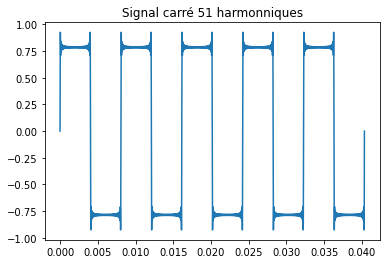
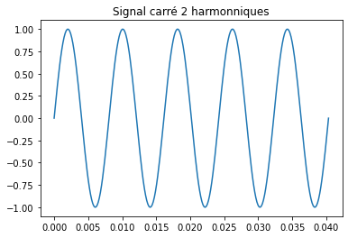
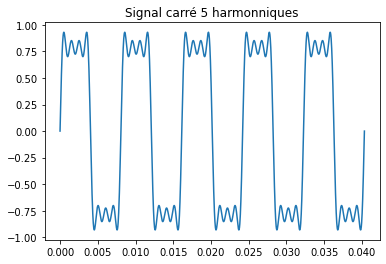
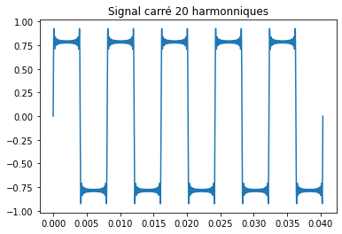
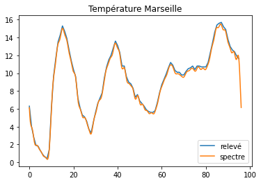
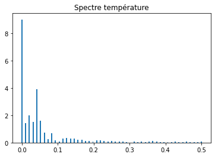
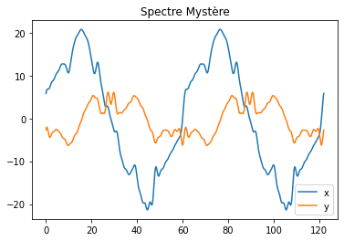
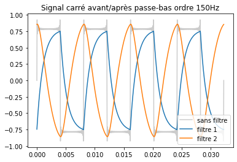

# Analyse spectrale et filtrage

## I. Analyse de Fourier : synthèse spectrale

#### 1.1. Construction d’une somme de Fourier
Q1.
```python
def synthèse(liste_f   : np.array,
             liste_amp : np.array,
             liste_phi : np.array,
             n_périodes = 5) -> (np.array, np.array):
    """
    Génère un signal à partir de la liste des fréquences et de la donnée
    du spectre.
    Renvoie deux tableaux : les temps et les valeurs du signal
    """
    # on part du principe que la liste des fréquences est dans triée dans l'ordre croissant
    t_max = n_périodes/liste_f[1]
    nb_points = int(t_max * liste_f[-1] * 50) 
    
    t = np.linspace(0, t_max, nb_points)
    s = lambda t : sum(A * cos(τ*f*t + phi) for f, A, phi in zip(liste_f, liste_amp, liste_phi))
    # s(t) = Σ A·cos(2πf·t + φ)
    s = np.vectorize(s) # pour appliquer la fontion a un tableau np
    
    return t, s(t)
```

#### 1.2. Premier exemple : signal carré
Q2. La fonction a une alure carré mais il y a de longues pointes sur les angles
 

Q3. On peut voir que le signal devient de + en + "carré" lorsqu'on ajoute des harmoniques.
 
 

#### 1.3. Deuxième exemple : températures
Q4.

Q5. Les deux principaux harmoniques sont celle de fréquence 0 et celle de période 24h.
Ce qui s'explique simplement par le fait que la température moyenne ne soit pas 0°C et par le fait que l'énergie radiative du soleil varie au crous de la journée (avec donc une période de 1 jour = 24h)


#### 1.4. (facultatif) Troisième exemple : signal mystère
Q6. On peut imaginer que x et y représentent la courbe d'une forme géométrique (carré/étoile) 

Q7. Bon...
.png)

--- 
## II. Action des filtres

#### 2.1. Passe-bas
Q8.
$$
	\underline{H} = \frac 1 {1 + j\frac f{f_c}}
	\implies
	\begin{equation*}
		\begin{cases}
			G = \frac 1 {\sqrt{1 + \left( \frac f{f_c} \right)^2 }} \newline
			\varphi = -arctan \left( \frac f{f_c} \right)
		\end{cases}
	\end{equation*}
$$
```python
def passe_bas_1(liste_f   : np.array,
                liste_A   : np.array,
                liste_phi : np.array,
                f_coupure : float) -> (np.array, np.array, np.array):
    """
    Renvoie le spectre filtré par le fonction de transfert
        H = (1 + 𝒋f/fc)⁻¹
    (passe-bas d'ordre 1')
    """
	        
    G = lambda f : 1/np.sqrt(1 + (f/f_coupure)**2) # Gain
    dec = lambda f : -np.arctan(f/f_coupure) # decalage de phase
    G, dec = np.vectorize(G), np.vectorize(dec)
    
    f_sortie = liste_f
    A_sortie = liste_A * G(liste_f)
    phi_sortie = liste_phi + dec(liste_f)
    
    return f_sortie, A_sortie, phi_sortie
```
---
$$
	\underline{H} = \frac 1 {1 - \left( \frac f{f_c} \right)^2 + j \sqrt 2 \frac f{f_c}}
	              = \frac {j \sqrt 2 \frac f{f_c}}
				          {1 + \frac j {\sqrt 2} \left( \frac f{f_c} - \frac{f_c}f \right) }
	\newline \implies
	\begin{equation*}
		\begin{cases}
			G = \frac 1 {\sqrt { 1 + \left( \frac f{f_c} \right)^4 }} \newline
			\varphi = \frac \pi 2 - arctan \left( \frac {\frac f{f_c} - \frac {f_c}f} {\sqrt 2} \right)
		\end{cases}
	\end{equation*}
$$

```python
def passe_bas_2(liste_f   : np.array,
                liste_A   : np.array,
                liste_phi : np.array,
                f_coupure : float) -> (np.array, np.array, np.array):
    """
    Renvoie le spectre filtré par le fonction de transfert
        H = (1 -(f/fc)² + 𝒋√2 f/fc)⁻¹
    (passe-bas d'ordre 2')
    """
	
    G = lambda f : 1/np.sqrt(1 + (f/f_coupure)**4) # Gain
    dec = lambda f : π/2 - np.arctan((f/f_coupure - f_coupure/np.float64(f))/2) # decalage de phase
    G, dec = np.vectorize(G), np.vectorize(dec)
    
    f_sortie = liste_f
    A_sortie = liste_A * G(liste_f)
    phi_sortie = liste_phi + dec(liste_f)
    
    return f_sortie, A_sortie, phi_sortie
```

Q9.
