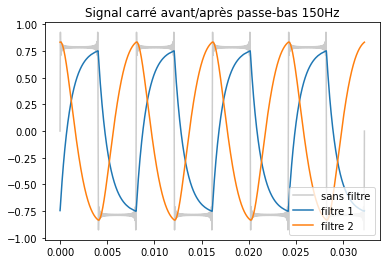
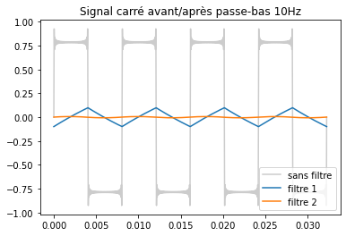
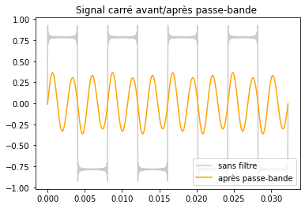
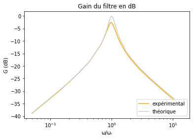
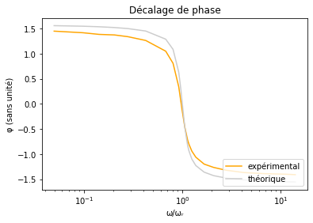

# Analyse spectrale et filtrage

## I. Analyse de Fourier : synthèse spectrale

#### 1.1. Construction d’une somme de Fourier
Q1.
```python
def synthèse(liste_f   : np.array,
             liste_amp : np.array,
             liste_phi : np.array,
             n_périodes = 5) -> (np.array, np.array):
    """
    Génère un signal à partir de la liste des fréquences et de la donnée
    du spectre.
    Renvoie deux tableaux : les temps et les valeurs du signal
    """
    # on part du principe que la liste des fréquences est dans triée dans l'ordre croissant
    t_max = n_périodes/liste_f[1]
    nb_points = int(t_max * liste_f[-1] * 50) 
    
    t = np.linspace(0, t_max, nb_points)
    s = lambda t : sum(A * cos(τ*f*t + phi) for f, A, phi in zip(liste_f, liste_amp, liste_phi))
    # s(t) = Σ A·cos(2πf·t + φ)
    s = np.vectorize(s) # pour appliquer la fontion a un tableau np
    
    return t, s(t)
```

#### 1.2. Premier exemple : signal carré
Q2. La fonction a une alure carré mais il y a de longues pointes sur les angles
 

Q3. On peut voir que le signal devient de + en + "carré" lorsqu'on ajoute des harmoniques.
 
 

#### 1.3. Deuxième exemple : températures
Q4.

Q5. Les deux principaux harmoniques sont celle de fréquence 0 et celle de période 24h.
Ce qui s'explique simplement par le fait que la température moyenne ne soit pas 0°C et par le fait que l'énergie radiative du soleil varie au crous de la journée (avec donc une période de 1 jour = 24h)


#### 1.4. (facultatif) Troisième exemple : signal mystère
Q6. On peut imaginer que x et y représentent la courbe d'une forme géométrique (carré/étoile) 

Q7. Bon...
.png)

--- 
## II. Action des filtres

#### 2.1. Passe-bas
Q8.
$$
	\underline{H} = \frac 1 {1 + j\frac f{f_c}}
	\implies
	\begin{equation*}
		\begin{cases}
			G = \frac 1 {\sqrt{1 + \left( \frac f{f_c} \right)^2 }} \newline
			\varphi = -arctan \left( \frac f{f_c} \right)
		\end{cases}
	\end{equation*}
$$
```python
def passe_bas_1(liste_f   : np.array,
                liste_A   : np.array,
                liste_phi : np.array,
                f_coupure : float) -> (np.array, np.array, np.array):
    """
    Renvoie le spectre filtré par le fonction de transfert
        H = (1 + 𝒋f/fc)⁻¹
    (passe-bas d'ordre 1')
    """
	        
    G = lambda f : 1/np.sqrt(1 + (f/f_coupure)**2) # Gain
    dec = lambda f : -np.arctan(f/f_coupure) # decalage de phase
    G, dec = np.vectorize(G), np.vectorize(dec)
    
    f_sortie = liste_f
    A_sortie = liste_A * G(liste_f)
    phi_sortie = liste_phi + dec(liste_f)
    
    return f_sortie, A_sortie, phi_sortie
```
---
$$
	\underline{H} = \frac 1 {1 - \left( \frac f{f_c} \right)^2 + j \sqrt 2 \frac f{f_c}}
	              = \frac {j \sqrt 2 \frac f{f_c}}
				          {1 + j \frac 1{\sqrt 2} \left( \frac f{f_c} - \frac{f_c}f \right) }
	\implies
	\begin{equation*}
		\begin{cases}
			G = \frac 1 {\sqrt { 1 + \left( \frac f{f_c} \right)^4 }} \newline
			\varphi = \frac \pi 2 - arctan \left( \frac {\frac f{f_c} - \frac {f_c}f} {\sqrt 2} \right)
		\end{cases}
	\end{equation*}
$$

```python
def passe_bas_2(liste_f   : np.array,
                liste_A   : np.array,
                liste_phi : np.array,
                f_coupure : float) -> (np.array, np.array, np.array):
    """
    Renvoie le spectre filtré par le fonction de transfert
        H = (1 -(f/fc)² + 𝒋√2 f/fc)⁻¹
    (passe-bas d'ordre 2')
    """
	
    G = lambda f : 1/np.sqrt(1 + (f/f_coupure)**4) # Gain
    dec = lambda f : π/2 - np.arctan((f/f_coupure - f_coupure/np.float64(f))/2) # decalage de phase
    G, dec = np.vectorize(G), np.vectorize(dec)
    
    f_sortie = liste_f
    A_sortie = liste_A * G(liste_f)
    phi_sortie = liste_phi + dec(liste_f)
    
    return f_sortie, A_sortie, phi_sortie
```

Q9. On remarque que:
 - les fonction sont plus proche de ce qu'on pouvait obtenir en tracant le sinal carré avec peu d'harmoniques.
 - le filtre d'ordre 1 "tord" plus les pointes
 - le filtre d'ordre 1 a ses pics contrés sur la *falling edge* alors que celui d'ordre 2 les a sur la *rising edge*


Q10. On peut remarquer que puisque la fréquence de coupure est plus basse que la fréquence la plus basse, le signal est applatit. Le filtre d'ordre 2 écrase plus, ce qui est cohérent avec le fait que sa coupure soit plus "sévère" que celle du filtre du 1er ordre.


Q11. $f_c = 1·10^{-3} h^{-1} = \frac {1·10^{-3}} {3600} s^{-1} \approx 3·10^{-7} s^{-1} $
Le filtre isole l'harmonique de fréquence 0, il agit donc commme un moyenneur.


---
## 2.2. Passe-bande

Q12. 
$$
    \underline H = \frac 1 {1 + 10 j \left( \frac f{f_r} - \frac{f_r}f \right) }
	             = \frac {j \frac 1{10} \frac f{f_r}}
                         {1 - \left( \frac f{f_r} \right)^2 + j \frac 1{10} \frac f{f_r}}    
	\implies
	\begin{equation*}
		\begin{cases}
			G = \frac 1 {\sqrt { 1 + 100 \left( \frac f{f_r} - \frac{f_r}f \right)^2 }} \newline
			\varphi = - arctan \left( 10 \left( \frac f{f_r} - \frac {f_r}f \right) \right)
		\end{cases}
	\end{equation*}
$$
```python
def passe_bande(liste_f   : np.array,
                liste_A   : np.array,
                liste_phi : np.array,
                f_coupure : float) -> (np.array, np.array, np.array):

    z = lambda f : (f/f_coupure - f_coupure/np.float64(f)) # fonction pour alléger les calculs
    
    G = lambda f : 1/np.sqrt(1 + 100 * z(f)**4) # Gain
    dec = lambda f : - np.arctan(10 * z(f)) # decalage de phase
    G, dec = np.vectorize(G), np.vectorize(dec)
    
    # f_sortie = liste_f
    A_sortie = liste_A * G(liste_f)
    phi_sortie = liste_phi + dec(liste_f)
    
    return liste_f, A_sortie, phi_sortie
```

Q13. Le filtre isole les fréquence autours de 372Hz, le signal sortant resemble donc a une cosinusoïdale de fréquence 372Hz, les hautes et basses fréquences ne sont plus visible, le signal n'est donc plus du tout carré.


---
# III. Étude d’un filtre expérimental

Q14.
En HF : la bobine se comporte comme un interupteur ouvert, donc $i=0$, donc $\underline u_s=0$
En BF : le condensateur se comporte comme un interupteur ouvert, donc $i=0$, donc $\underline u_s=0$
Le circuit est donc un filtre passe-bande.
$$
\underline H = \frac {\underline u_s} {\underline u_e} = \frac R {R + jL\omega + \frac 1 {jC\omega}}
    = \frac {jRC\omega} {1 - LC \omega^2 + jRC\omega}
    = \frac 1 {1 + j \left( \frac LR \omega - \frac 1{RC\omega}\right)}
\newline \implies 
\begin{equation*}
    \begin{cases}
        \omega_r = \frac 1{\sqrt {LC}} \implies f_r = \frac 1 {2 \pi \sqrt{LC}}\newline
        Q = \frac 1R \sqrt{\frac LC}
    \end{cases}
\end{equation*}
\newline
\underline H = \frac 1 {1 + jQ(\xi + \frac 1\xi)} \quad avec \quad \xi = \frac \omega {\omega _r} = \frac f {f_r}
$$

Q15.
$$
R = 100,6 \Omega \qquad L = 0,09590H \qquad C = 0.5006 \mu F \newline
\implies \omega_r = 4564 s^{-1} \qquad f_r = 726.3 Hz \qquad Q = 4.351
$$
$$
G = \frac 1 {\sqrt{1 + Q^2 \left(\xi - \frac 1\xi \right)^2}} \newline
\implies G_{dB} = 20log(G) = -10 log \left(1 + Q^2 \left(\xi - \frac 1\xi \right)^2\right) \newline
\varphi = -arctan \left( Q \left( \xi - \frac 1\xi \right) \right)
$$

Q16.
 